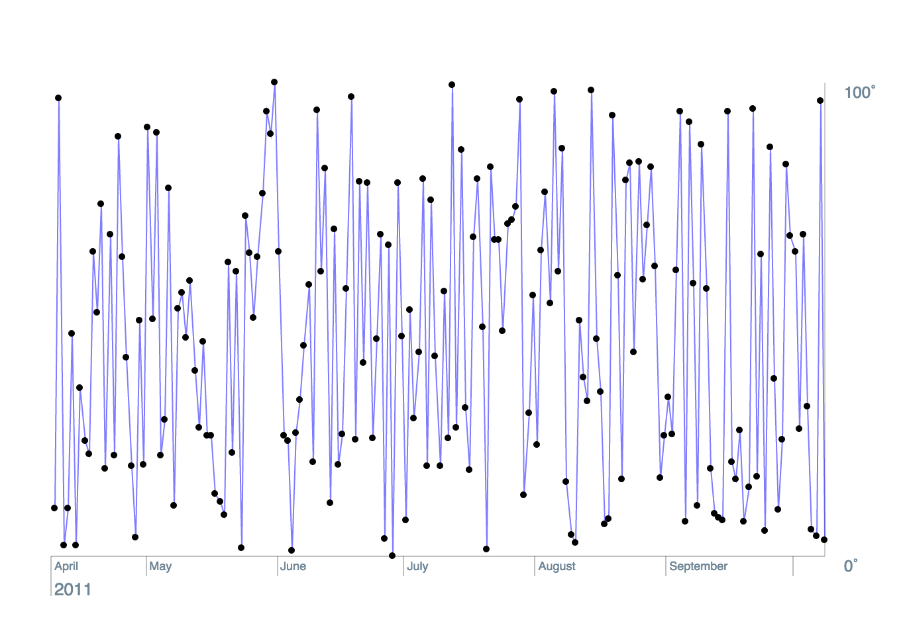

# react-data-viz

ReactDataViz is a library for rendering data visualizations on a canvas DOM node using React.

It depends on [react-canvas](https://github.com/Flipboard/react-canvas) for integrating with React.

Here is an example of a simple time chart:



```coffeescript
{TimeAxis,
Axis,
LinearScale} = ReactDataViz
{Surface,
MultiLine}   = ReactCanvas

TimeSeriesChart = React.createClass
  render: ->
    <Surface
      top    = 0
      left   = 0
      width  = {@state.timeScale.range[1] + 100}
      height = {@state.temperatureScale.range[1] + 100}
    >
      # The x axis, Time
      <TimeAxis
        axisName     = 'Time'
        scale        = @state.timeScale
        axis         = 'x'
        placement    = 'below'
        direction    = 'right'
        origin       = @getOrigin()
      />

      # The y axis, Temperature
      <Axis
        scale     = @state.temperatureScale
        axis      = 'y'
        placement = 'left'
        direction = 'up'
        origin    = @getOrigin()
      />

      {@renderTemperatureLine()}

    </Surface>

  renderTemperatureLine: ->
      origin = @getOrigin()
      points = _.map @state.data, ({time, temperature}) =>
        x: @state.timeScale.map(time) + origin.x
        y: -@state.temperatureScale.map(temperature) + origin.y

      <MultiLine # a line connecting a sequence of points
        points = points
      />

  getOrigin: ->
    x: 50
    y: @state.temperatureScale.range[1] + 50

  # Generate fake data and create the scales mapping data -> pixels
  getInitialState: ->
    start = new Date(2011, 1, 1).getTime()
    end   = new Date(2012, 6, 1).getTime()

    timeScale = # maps values from epoch -> pixel
      new LinearScale
        domain: [start, end]
        range:  [0, 500]

    temperatureScale = # maps values from temperature -> pixel
      new LinearScale
        domain: [40, 80]
        range:  [0, 400]

    data =
      for tick in timeScale.ticks()
        temp = 40 + Math.random() * 40
        {time: tick, temperature: temp}

    {timeScale, temperatureScale, data}

```
